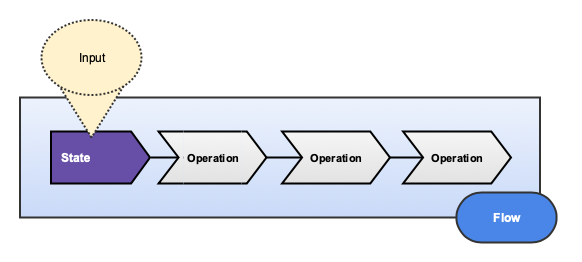

# Flow

[](https://badge.fury.io/rb/flow)
[](https://semaphoreci.com/freshly/flow)
[](https://codeclimate.com/github/Freshly/flow/maintainability)
[](https://codeclimate.com/github/Freshly/flow/test_coverage)

* [Installation](#installation)
* [What is Flow?](#what-is-flow)
* [How it Works](#how-it-works)
   * [Flows](#flows)
   * [Operations](#operations)
   * [States](#states)
* [Errors](#errors)
   * [Exceptions](#exceptions)
   * [Failures](#failures)
   * [Statuses](#statuses)
* [Reverting a Flow](#reverting-a-flow)
   * [Undoing Operations](#undoing-operations)
* [Transactions](#transactions)
   * [Around a Flow](#around-a-flow)
   * [Around an Operation](#around-an-operation)
   * [Input](#input)
   * [Validations](#validations)
   * [Derivative Data](#derivative-data)
   * [Mutable Data](#mutable-data)
* [Utilities](#utilities)
   * [Callbacks](#callbacks)
   * [Memoization](#memoization)
   * [Logging](#logging)
* [Testing](#testing)
   * [Testing Setup](#testing-setup)
   * [Testing Flows](#testing-flows)
   * [Testing Operations](#testing-operations)
   * [Testing States](#testing-states)
   * [Integration Testing](#integration-testing)
* [Contributing](#contributing)
   * [Development](#development)
* [License](#license)


## Installation

Add this line to your application's Gemfile:

```ruby
gem "flow"
```

Then, in your project directory:

```bash
$ bundle install
$ rails generate flow:install
```

## What is Flow?

Flow is a [SOLID](https://en.wikipedia.org/wiki/SOLID) implementation of the [Command Pattern](https://en.wikipedia.org/wiki/Command_pattern) for Ruby on Rails.

Flows allow you to encapsulate your application's [business logic](http://en.wikipedia.org/wiki/Business_logic) in using a set of discrete, extensible, and reusable objects.

## How it Works



There are three important concepts to distinguish here: [Flows](#Flows), [Operations](#Operations), and [States](#States).

### Flows

A **Flow** is a collection of procedurally executed **Operations** sharing a common **State**.

```ruby
class CalculateTimetablesFlow < ApplicationFlow
  operations ClearExistingTimetables, CalculateTimetables, SummarizeTimetables, DestroyEmptyTimetableCells
end
```

The `operations` are an ordered list of the behaviors which are executed with (and possibly change) the Flow's state.

Flows accept input representing the arguments and options which define the initial state.

```ruby
CalculateTimetablesFlow.trigger(timeframe: Day.today)
```

When `#trigger` is called on a Flow, `#execute` is called on Operations sequentially in their given order. 

Triggering a Flow executes all its operations in sequential order if **and only if** it has a valid state.

### Operations

An **Operation** is a service object which is executed with a **State**.

```ruby
class ClearExistingTimetables < ApplicationOperation
  def behavior
    state.existing_timetable_cells.update_all(total_minutes: 0)
  end
end
```

```ruby
class CalculateTimetables < ApplicationOperation
  def behavior
    state.minutes_by_project_employee.each do |project_employee, total_minutes|
      project_id, employee_id = project_employee
      timetable = state.timeframe.timetables.find_or_create_by!(project_id: project_id)
      timetable.cells.find_or_create_by!(employee_id: employee_id).update!(total_minutes: total_minutes)
    end
  end
end
```

```ruby
class SummarizeTimetables < ApplicationOperation
  def behavior
    state.timetables.each { |timetable| timetable.update!(total_minutes: timetable.cells.sum(:total_minutes)) }
  end
end
```

```ruby
class DestroyEmptyTimetableCells < ApplicationOperation
  def behavior
    state.empty_cells.destroy_all
  end
end
```

Operations take a state as input and define a `#behavior` that occurs when `#execute` is called.

### States

A **State** is an aggregation of input and derived data.

```ruby
class CalculateTimetablesState < ApplicationState
  argument :timeframe

  def existing_timetable_cells
    @existing_timetable_cells ||= TimetableCell.where(timetable: existing_timetables)
  end

  def minutes_by_project_employee
    @minutes_by_project_employee ||= data_by_employee_project.transform_values { |values| values.sum(&:total_minutes) }
  end

  def timetables
    @timetables ||= Timetable.where(project_id: project_ids)
  end

  def empty_cells
    @empty_cells ||= TimetableCell.joins(:timetable).where(total_minutes: 0, timetables: { project_id: project_ids })
  end

  private

  delegate :timesheets, to: :timeframe

  def existing_timetables
    @existing_timetables ||= timeframe.timetables.where(project_id: project_ids)
  end

  def project_ids
    @project_ids ||= timesheet_data.map(&:project_id).uniq
  end

  def data_by_employee_project
    @data_by_employee_project ||= timesheet_data.group_by { |data| [ data.project_id, data.employee_id ] }
  end

  def timesheet_data
    @timesheet_data ||= timesheets.
      reportable.
      summarizable.
      joins(:timeclock).
      select("timeclocks.project_id, timeclocks.employee_id, timesheets.total_minutes")
  end
end
```

A state accepts input represented by **arguments** and **options** which initialize it.
 
**Arguments** describe input required to define the initial state.

If any arguments are missing, an `ArgumentError` is raised.

```ruby
class ExampleFlow < ApplicationFlow; end
class ExampleState < ApplicationState
  argument :foo
  argument :bar
end

ExampleFlow.trigger # => ArgumentError (Missing arguments: foo, bar)
ExampleFlow.trigger(foo: :foo) # => ArgumentError (Missing argument: bar)
ExampleFlow.trigger(foo: :foo, bar: :bar) # => #<ExampleFlow:0x00007ff7b7d92ae0 ...>
```

**Options** describe input which may be provided to define or override the initial state.

Options can optionally define a default value. 

If no default is specified, the value will be `nil`.

If the default value is static, it can be specified in the class definition.

If the default value is dynamic, you may provide a block to compute the default value.

⚠️‍ *Heads Up*: The default value blocks **DO NOT** provide access to the state or it's other variables!

```ruby
class ExampleFlow < ApplicationFlow; end
class ExampleState < ApplicationState
  option :attribution_source
  option :favorite_foods, default: %w[pizza ice_cream gluten]
  option(:favorite_color) { SecureRandom.hex(3) }
end

result = ExampleFlow.trigger(favorite_foods: %w[avocado hummus nutritional_yeast])
state = result.state

state.attribution_source # => nil
state.favorite_color # => "1a1f1e"
state.favorite_foods # => ["avocado", "hummus" ,"nutritional_yeast"]
```

## Errors

TODO...

### Exceptions

TODO...

### Failures

TODO...

### Statuses

TODO...

## Reverting a Flow

TODO...

### Undoing Operations

TODO...

## Transactions

TODO...

### Around a Flow

TODO...

### Around an Operation

TODO...

### Input

TODO...

### Validations

TODO...

### Derivative Data

TODO...

### Mutable Data

TODO...

## Utilities

TODO...

### Callbacks

TODO...

### Memoization

TODO...

### Logging

TODO...

## Testing

If you plan on writing `RSpec` tests `Flow` comes packaged with some custom matchers.

### Testing Setup

Add the following to your `spec/rails_helper.rb` file:

```ruby
require "flow/spec_helper"
```

Flow works best with [shoulda-matchers](https://github.com/thoughtbot/shoulda-matchers) and [rspice](https://github.com/Freshly/spicerack/tree/develop/rspice).

Add those to the `development` and `test` group of your Gemfile:

```ruby
group :development, :test do 
  gem "shoulda-matchers", git: "https://github.com/thoughtbot/shoulda-matchers.git", branch: "rails-5"
  gem "rspice"
end
```

Then run `bundle install` and add the following into `spec/rails_helper.rb`:

```ruby
require "rspec/rails"
require "rspice"
require "flow/spec_helper"

# Configuration for the shoulda-matchers gem
Shoulda::Matchers.configure do |config|
  config.integrate do |with|
    with.test_framework :rspec
    with.library :rails
  end
end
```

This will allow you to use the [define_argument](lib/flow/custom_matchers/define_argument.rb), [define_option](lib/flow/custom_matchers/define_option.rb), and [use_operations](lib/flow/custom_matchers/use_operations.rb) helpers.

### Testing Flows

TODO...

### Testing Operations

TODO...

### Testing States

TODO...

### Integration Testing

TODO...

## Contributing

Bug reports and pull requests are welcome on GitHub at https://github.com/freshly/flow.

### Development

After checking out the repo, run `bin/setup` to install dependencies. Then, run `rake spec` to run the tests. You can also run `bin/console` for an interactive prompt that will allow you to experiment.

To install this gem onto your local machine, run `bundle exec rake install`. To release a new version, update the version number in `version.rb`, and then run `bundle exec rake release`, which will create a git tag for the version, push git commits and tags, and push the `.gem` file to [rubygems.org](https://rubygems.org).

## License

The gem is available as open source under the terms of the [MIT License](https://opensource.org/licenses/MIT).
