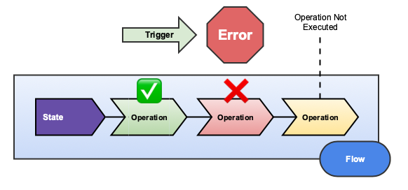
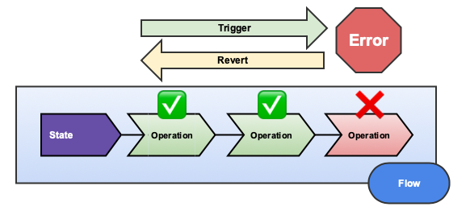
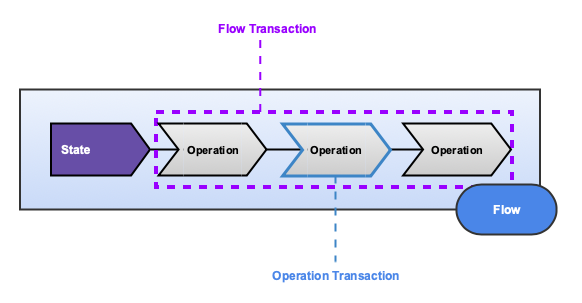

# Flow

[](https://badge.fury.io/rb/flow)
[](https://semaphoreci.com/freshly/flow)
[](https://codeclimate.com/github/Freshly/flow/maintainability)
[](https://codeclimate.com/github/Freshly/flow/test_coverage)

* [Installation](#installation)
* [Getting Started](getting-started)
* [What is Flow?](#what-is-flow)
* [How it Works](#how-it-works)
   * [Flows](#flows)
   * [Operations](#operations)
   * [States](#states)
      * [Input](#input)
      * [Mutable Data](#mutable-data)
      * [Derivative Data](#derivative-data)
      * [State Concerns](#state-concerns)
      * [Validations](#validations)
* [Errors](#errors)
   * [Exceptions](#exceptions)
   * [Failures](#failures)
   * [Callback Events](#callback-events)
* [Reverting a Flow](#reverting-a-flow)
   * [Undoing Operations](#undoing-operations)
   * [Manual Revert](#manual-revert)
* [Transactions](#transactions)
   * [Around a Flow](#around-a-flow)
   * [Around an Operation](#around-an-operation)
* [Statuses](#statuses)
* [Utilities](#utilities)
   * [Callbacks](#callbacks)
   * [Memoization](#memoization)
   * [Logging](#logging)
* [Inheritance](#inheritance)
* [Testing](#testing)
   * [Testing Setup](#testing-setup)
   * [Testing Flows](#testing-flows)
   * [Testing Operations](#testing-operations)
   * [Testing States](#testing-states)
   * [Integration Testing](#integration-testing)
* [Contributing](#contributing)
   * [Development](#development)
* [License](#license)

## Installation

Add this line to your application's Gemfile:

```ruby
gem "flow"
```

Then, in your project directory:

```bash
$ bundle install
$ rails generate flow:install
```

## Getting Started

Flow comes with some nice rails generators. You are encouraged to use them!

```bash
$ rails generate flow Foo
  invoke  state
  invoke    rspec
  create      spec/states/foo_state_spec.rb
  create    app/states/foo_state.rb
  invoke  rspec
  create    spec/flows/foo_flow_spec.rb
  create  app/flows/foo_flow.rb
$ rails generate flow:state Bar
  invoke  rspec
  create    spec/states/bar_state_spec.rb
  create  app/states/bar_state.rb
$ rails generate flow:operation MakeTheThingDoTheStuff
  invoke  rspec
  create    spec/operations/make_the_thing_do_the_stuff_spec.rb
  create  app/operations/make_the_thing_do_the_stuff.rb
```

## What is Flow?

Flow is a [SOLID](https://en.wikipedia.org/wiki/SOLID) implementation of the [Command Pattern](https://en.wikipedia.org/wiki/Command_pattern) for Ruby on Rails.

Flows allow you to encapsulate your application's [business logic](http://en.wikipedia.org/wiki/Business_logic) into a set of extensible and reusable objects.

## How it Works


There are three important concepts to distinguish here: [Flows](#Flows), [Operations](#Operations), and [States](#States).

### Flows

A **Flow** is a collection of procedurally executed **Operations** sharing a common **State**.

All Flows should be named with the `Flow` suffix (ex: `FooFlow`).

```ruby
class CalculateTimetablesFlow < ApplicationFlow
  operations ClearExistingTimetables, 
             CalculateTimetables, 
             SummarizeTimetables, 
             DestroyEmptyTimetableCells
end
```

The `operations` are an ordered list of the behaviors which are executed with (and possibly change) the Flow's state.

Flows accept input representing the arguments and options which define the initial state.

```ruby
CalculateTimetablesFlow.trigger(timeframe: Day.today)
```

Triggering a Flow executes all its operations in sequential order if **and only if** it has a valid state.

When `#trigger` is called on a Flow, `#execute` is called on Operations sequentially in their given order (referred to as a **flux**).

Unless otherwise specified a **Flow** assumes its state class shares a common name.

Ex: `FooBarBazFlow` assumes there is a defined `FooBarBazState`.

If you want to customize this behavior, define the state class explicitly:

```ruby
class ExampleFlow < ApplicationState
  def self.state_class
    MyCoolState
  end
end
```

### Operations

An **Operation** is a service object which is executed with a **State**.

Operations should **not** be named with the `Operation` suffix; name them what they do!

```ruby
class ClearExistingTimetables < ApplicationOperation
  def behavior
    state.existing_timetable_cells.update_all(total_minutes: 0)
  end
end
```

```ruby
class CalculateTimetables < ApplicationOperation
  def behavior
    state.minutes_by_project_employee.each do |project_employee, total_minutes|
      project_id, employee_id = project_employee
      timetable = state.timeframe.timetables.find_or_create_by!(project_id: project_id)
      cell = timetable.cells.find_or_create_by!(employee_id: employee_id)
      
      cell.update!(total_minutes: total_minutes)
    end
  end
end
```

```ruby
class SummarizeTimetables < ApplicationOperation
  def behavior
    state.timetables.each do |timetable| 
      timetable.update!(total_minutes: timetable.cells.sum(:total_minutes))
    end
  end
end
```

```ruby
class DestroyEmptyTimetableCells < ApplicationOperation
  def behavior
    state.empty_cells.destroy_all
  end
end
```

Operations take a state as input and define a `#behavior` that occurs when `#execute` is called.

💁‍ *Pro Tip*: Operations are just objects! They can be used outside of Flows. Just give them a State (or a State-like object) and you can use them in isolation!

```ruby
class ExampleOperation < ApplicationOperation
  def behavior
    puts "Hello, #{state.first_name}"
  end
end

operation = ExampleOperation.new(OpenStruct.new(first_name: "Eric"))
operation.execute 
# Hello, Eric
operation.executed? # => true 
```

### States

A **State** is an aggregation of input and derived data.

All States should be named with the `State` suffix (ex: `FooState`).

```ruby
class CalculateTimetablesState < ApplicationState
  argument :timeframe

  def existing_timetable_cells
    @existing_timetable_cells ||= TimetableCell.where(timetable: existing_timetables)
  end

  def minutes_by_project_employee
    @minutes_by_project_employee ||= data_by_employee_project.transform_values do |values| 
      values.sum(&:total_minutes)
    end
  end

  def timetables
    @timetables ||= Timetable.where(project_id: project_ids)
  end

  def empty_cells
    @empty_cells ||= TimetableCell.
      joins(:timetable).
      where(total_minutes: 0, timetables: { project_id: project_ids })
  end

  private

  delegate :timesheets, to: :timeframe

  def existing_timetables
    @existing_timetables ||= timeframe.timetables.where(project_id: project_ids)
  end

  def project_ids
    @project_ids ||= timesheet_data.map(&:project_id).uniq
  end

  def data_by_employee_project
    @data_by_employee_project ||= timesheet_data.group_by do |data| 
      [ data.project_id, data.employee_id ]
    end
  end

  def timesheet_data
    @timesheet_data ||= timesheets.
      reportable.
      summarizable.
      joins(:timeclock).
      select("timeclocks.project_id, timeclocks.employee_id, timesheets.total_minutes")
  end
end
```

#### Input

A state accepts input represented by **arguments** and **options** which initialize it.
 
**Arguments** describe input required to define the initial state.

If any arguments are missing, an `ArgumentError` is raised.

```ruby
class ExampleFlow < ApplicationFlow; end
class ExampleState < ApplicationState
  argument :foo
  argument :bar
end

ExampleFlow.trigger # => ArgumentError (Missing arguments: foo, bar)
ExampleFlow.trigger(foo: :foo) # => ArgumentError (Missing argument: bar)
ExampleFlow.trigger(foo: :foo, bar: :bar) # => #<ExampleFlow:0x00007ff7b7d92ae0 ...>
```

**Options** describe input which may be provided to define or override the initial state.

Options can optionally define a default value. 

If no default is specified, the value will be `nil`.

If the default value is static, it can be specified in the class definition.

If the default value is dynamic, you may provide a block to compute the default value.

⚠️‍ **Heads Up**: The default value blocks **DO NOT** provide access to the state or it's other variables!

```ruby
class ExampleFlow < ApplicationFlow; end
class ExampleState < ApplicationState
  option :attribution_source
  option :favorite_foods, default: %w[pizza ice_cream gluten]
  option(:favorite_color) { SecureRandom.hex(3) }
end

result = ExampleFlow.trigger(favorite_foods: %w[avocado hummus nutritional_yeast])
state = result.state

state.attribution_source # => nil
state.favorite_color # => "1a1f1e"
state.favorite_foods # => ["avocado", "hummus" ,"nutritional_yeast"]
```

#### Mutable Data
    
States can define objects specifically to be populated by operations as they run.

Mutable operation data is not conceptually distinct from other operation data, not technically.

This section is really just a heads up that you can do things like this:

```ruby
class ExampleState < ApplicationState
  option :string_buffer, default: []
end

class AskAQuestion < ApplicationOperation
  def behavior
    state.string_buffer << "Bah Bah, Black Sheep. Have you any wool?"
  end
end

class GiveAnAnswer < ApplicationOperation
  def behavior
    state.string_buffer << "Yes sir, yes sir! Three bags full!"
  end
end

class ExampleFlow < ApplicationFlow
  operations AskAQuestion, GiveAnAnswer
end

result = ExampleFlow.trigger(string_buffer: ["A conversation, for your consideration:"])
result.state.string_buffer.join("\n")
# A conversation, for your consideration:
# Bah Bah, Black Sheep. Have you any wool?
# Yes sir, yes sir! Three bags full! 
```

#### Derivative Data

States provide you with a clear place to put any logic related to pre-processing of data.

They also can help give developers a clear picture of how your data fits together:

```ruby
class ExampleState < ApplicationState
  argument :user

  def most_actionable_order
    editable_orders.order(ship_date: :desc).first
  end
  
  private

  def editable_orders
    user.orders.unshipped.paid
  end
end
```

#### State Concerns

The architecture of each Flow having it's own state introduces a code reuse constraint.

Consider the following example:

```ruby
class MyExampleState < ApplicationState
  argument :user
  
  def most_actionable_order
    editable_orders.order(ship_date: :desc).first
  end
  
  private
  
  def editable_orders
    user.orders.unshipped.paid
  end
end

class MyOtherExampleState < ApplicationState
  argument :user
  
  def least_actionable_order
    editable_orders.order(ship_date: :desc).last
  end
  
  private
  
  def editable_orders
    user.orders.unshipped.paid
  end
end
```

The recommended way to share common code between your states is by using concerns.

For example, we could create `app/states/concerns/actionable_user_orders.rb`:

```ruby
module ActionableUserOrders
  extend ActiveSupport::Concern
  
  included do
    argument :user
  end
  
  private

  def orders_by_ship_data
    editable_orders.order(ship_date: :desc)
  end
  
  def editable_orders
    user.orders.unshipped.paid
  end
end
```

Then your states become nice and clean:

```ruby
class MyExampleState < ApplicationState
  include ActionableUserOrders
  
  def most_actionable_order
    orders_by_ship_data.first
  end
end

class MyOtherExampleState < ApplicationState
  include ActionableUserOrders
  
  def least_actionable_order
    orders_by_ship_data.last
  end
end
```

#### Validations

States are ActiveModels which means they have access to [ActiveModel::Validations](https://api.rubyonrails.org/classes/ActiveModel/Validations.html).

It is considered a best practice to write validations in your states.

Flows which have an invalid state will NOT execute any Operations, so it is inherently the safest and clearest way to proactively communicate about missed expectations.

💁‍ **Pro Tip**: There is a `trigger!` method on Flows that will raise certain errors that are normally silenced. Invalid states are one such example!

```ruby
class ExampleFlow < ApplicationFlow; end
class ExampleState < ApplicationState
  argument :first_name
  
  validates :first_name, length: { minimum: 2 }
end

ExampleFlow.trigger!(first_name: "a") # => raises Flow::Errors::StateInvalid

result = ExampleFlow.trigger(first_name: "a")
result.success? # => false
result.failed? # => false
result.triggered? # => false
result.state.errors.messages # => {:first_name=>["is too short (minimum is 2 characters)"]}
```

## Errors



When `#execute` is unsuccessful, expected problems are **failures** and unexpected problems are **Exceptions**.

Errors handling can be either either **proactive** or **reactive**; ideally all errors that can be are *proactive*.

**Proactive** error handling is a form of defensive programming. Instead of letting an error occur, you fail with a very clear signal as to why. Explicit failures are more desirable than  than letting unexpected behavior dictate the program flow.

**Reactive** error handling should be used to handle areas of the code where you do not control the underlying behaviors, such as integrations with third party gems. When you know something you can't prevent could happen, you can define a reactive error handler to cleanly translate an *exception* into a *failure*.

### Exceptions

When an exception is raised during during execution, but a handler can rescue, it causes a failure instead.

Otherwise, an unhandled exception will raise through both the Operation and Flow.
`
```ruby
class ExampleState < ApplicationState
  argument :number
end

class ExampleOperation < ApplicationOperation
  handle_error RuntimeError
  
  def behavior
    raise (state.number % 2 == 0 ? StandardError : RuntimeError)
  end
end

class ExampleFlow < ApplicationFlow
  operations ExampleOperation
end

ExampleFlow.trigger(number: 0) # => raises StandardError
result = ExampleFlow.trigger(number: 1)
result.failed? # => true

operation_failure = result.failed_operation.operation_failure
operation_failure.problem # => :runtime_error
operation_failure.details.exception # => #<RuntimeError: RuntimeError>
```

Handlers are inherited. They are searched from right to left, from bottom to top, and up the hierarchy. The handler of the first class for which exception.is_a?(klass) holds true is the one invoked, if any.

If no problem is specified explicitly, a demodulized underscored version of the error is used.

```ruby
class ExampleOperation < ApplicationOperation
  handle_error RuntimeError, problem: :something_bad_happened
  handle_error ActiveRecord::RecordInvalid
  
  def behavior
    raise (state.number % 2 == 0 ? ActiveRecord::RecordInvalid : RuntimeError)
  end
end

result0 = ExampleFlow.trigger(number: 0)
operation_failure = result0.failed_operation.operation_failure
operation_failure.problem # => :record_invalid
operation_failure.details.exception # => #<ActiveRecord::RecordInvalid: Record invalid>

result1 = ExampleFlow.trigger(number: 1)
result1.failed_operation.operation_failure.problem # => :something_bad_happened
```

You can also provide handlers in the form of either a block or a method name:

```ruby
class ExampleOperation < ApplicationOperation
  handle_error RuntimeError, with: :handle_some_error
  handle_error ActiveRecord::RecordInvalid do
    # Do something here
  end
  
  def behavior
    raise (state.number % 2 == 0 ? ActiveRecord::RecordInvalid : RuntimeError)
  end
  
  private
  
  def handle_some_error
    # Do something different here
  end
end
```

### Failures

In theory, failures should *never* occur in your Flows. Any guard clause you can put inside of an Operation to proactively fail you should be able to put inside of the state as a validation.

In practice, failures will *always* occur in your Flows. Any sufficiently large organization will receive contributions from developers of all skill and business-specific knowledge levels. The suggested use of one State class per Flow means that if every state is responsible for proactive validation, you will eventually have a misstep and forget to include it.

Having your Operation proactively fail is an example of [contract programming](https://en.wikipedia.org/wiki/Design_by_contract) and provides developers with a clear and non-brittle expectation of how it should be used.

From a conceptual standpoint, you should consider your Operations as the most atomic expression of your business logic. Flows, and (by extension) the States that support them, are most effective when built up around a well defined set of Operations.

When your system has multiple consistent ways to defend against corrupt data or prevent   executions that generate exceptions, it's robust not redundant.

`</rant>`

Failures are part of the class definition of your Operation.

```ruby
class PassBottlesAround < ApplicationOperation
  failure :too_generous

  def behavior
    too_generous_failure! if state.number_to_take_down >= 4
  end
end
```

When you define a failure a `#{failure_name}_failure!` method is defined for you.

Calling this `_failure!` method will raise an exception which Flow handles by default, meaning it will not be raised as an exception from the Flow.

An unstructured hash of data can be provided to the `_failure!` method and will be available in the `operation_failure` object:

```ruby
class PassBottlesAround < ApplicationOperation
  failure :too_generous

  def behavior
    if state.number_to_take_down >= 4
      disappointment_level = state.number_to_take_down >= 10 ? :wow_very_disappoint : :am_disappoint
      too_generous_failure!(disappointment_level: disappointment_level) 
    end
  end
end

result5 = ExampleFlow.trigger(number_to_take_down: 5)
operation_failure5 = result5.failed_operation.operation_failure
operation_failure5.problem # => :too_generous
operation_failure5.details.disappointment_level # => :am_disappoint

result11 = ExampleFlow.trigger(number_to_take_down: 11)
operation_failure11 = result11.failed_operation.operation_failure
operation_failure11.problem # => :too_generous
operation_failure11.details.disappointment_level # => :wow_very_disappoint
```

### Callback Events

Operations feature error events which are triggered when a problem occurs.

This works for explictly defined failures:

```ruby
class OperationOne < ApplicationOperation
  failure :too_greedy
  
  on_too_greedy_failure do
    SlackClient.send_message(:engineering, "Someones trying to give away too much stuff!")
  end
end
```

As well as manually handled errors (using the demodulized underscored name of the error):

```ruby
class OperationTwo < ApplicationOperation
  handle_error ActiveRecord::RecordInvalid
  
  on_record_invalid_failure do
    Redis.incr("operation_two:invalid_records")
  end
end
```

You can also listen for any problems using the generic failure event:

```ruby
class OperationThree < ApplicationOperation
  handle_error RuntimeError
  
  on_failure do
    EngineeringMailer.on_runtime_error(self.class.name)
  end
end
```

## Reverting a Flow



When something goes wrong in Flow `#revert` is called. 

This calls `#rewind` on Operations to `#undo` their behavior.

Reverting a Flow rewinds all its executed operations in reverse order (referred to as an **ebb**).

Reverting is automatic and happens by default. You cannot opt out of the revert process, but you can choose to not define any `#undo` methods on your Operations.
 
```ruby
class ExampleState < ApplicationState; end

class GenericOperation < ApplicationOperation
  def behavior
    puts "#{self.class.name}#behavior"
  end
  
  def undo
    puts "#{self.class.name}#undo"
  end
end

class ExampleFlow < ApplicationFlow
  operations OperationOne, OperationTwo, OperationThree, OperationFour
end

class OperationOne < GenericOperation; end
class OperationTwo < GenericOperation; end
class OperationThree < GenericOperation
  failure :bad_stuff
  
  def behavior
    super
    bad_stuff_failure!
  end
end
class OperationFour < GenericOperation; end

ExampleFlow.trigger

# Prints:
#  OperationOne#behavior
#  OperationTwo#behavior
#  OperationThree#behavior
#  OperationTwo#undo
#  OperationOne#undo
```

⚠️ **Heads Up**: For the Operation that failed, `#undo` is **NOT** called. Only operations which execute successfully can be undone.

### Undoing Operations

```ruby
class ReserveQuantity < ApplicationOperation
  delegate :product, :quantity, to: :state
  delegate :available_inventory_count, to: :product
  
  def behavior
    product.update!(available_inventory_count: available_inventory_count - quantity)
  end
  
  def undo
    product.update!(available_inventory_count: available_inventory_count + quantity)
  end
end
```

💁‍ *Note*: If you omit the `#undo`, a revert will essentially pass over that Operation. 

If your Operation should not be undone and you want it to halt reverting, call a defined failure in `#undo`.

```ruby
class ExampleOperation < ApplicationOperation
  failure :irreversible_behavior
  
  def behavior
    PurchaseService.charge_customer(state.customer)
  end
  
  def undo
    irreversible_behavior_failure!
  end
end
```

### Manual Revert

Flows in which an error occur are reverted automatically.

You can also manually revert a completed flow, even if it was fully successful.

```ruby
class ExampleFlow < ApplicationFlow
  operations OperationOne, OperationTwo, OperationThree, OperationFour
end

flow = SomeExampleFlow.trigger
#  OperationOne#behavior
#  OperationTwo#behavior
#  OperationThree#behavior
#  OperationFour#behavior
flow.success? # => true
flow.revert
#  OperationFour#undo
#  OperationThree#undo
#  OperationTwo#undo
#  OperationOne#undo
flow.reverted? # => true
```

## Transactions



Flow features a callback driven approach to wrap business logic within database transaction.

Both **Flows** and **Operations** can be wrapped with a transaction.

🚨 *Be Aware*: Unless otherwise specified, transactions apply to **both** success **and** failure cases. You can pass `only:` or `except:` options to `wrap_in_transaction` to alter this behavior.
 
### Around a Flow

Flows where no operation should be persisted unless all are successful should use a transaction.

```ruby
class ExampleFlow < ApplicationFlow
  wrap_in_transaction
  
  operations OperationOne, OperationTwo, OperationThree
end
```

Flows can transaction wrap `:flux` (caused by `#trigger`) or `:ebb` (caused by `#revert`).

```ruby
class ExampleFlow < ApplicationFlow
  wrap_in_transaction only: :flux
end

class ExampleFlow < ApplicationFlow
  wrap_in_transaction except: :ebb
end
```

### Around an Operation

Operations which modify several persisted objects together should use a transaction.

```ruby
class OperationTwo < ApplicationFlow
  wrap_in_transaction
 
  def behavior
    # do a thing
  end
end
```

Operations can transaction wrap `:behavior` or `:undo`.

```ruby
class ExampleOperation < ApplicationOperation
  wrap_in_transaction only: :behavior
end

class ExampleOperation < ApplicationOperation
  wrap_in_transaction except: :undo
end
```

## Statuses

Flows and Operations each have a set of predicate methods to describe their current status.

| Object    | Status       | Description               |
| --------- | ------------ | ------------------------- |
| Operation | `executed?`  | `#execute` was called.    |
| Operation | `failed?`    | Execution failed.         |
| Operation | `success?`   | Execution succeeded.      |
| Flow      | `pending?`   | `#trigger` not called.    |
| Flow      | `triggered?` | `#trigger` was called.    |
| Flow      | `failed?`    | Some operation failed.    |
| Flow      | `success?`   | All operations succeeded. |
| Flow      | `reverted?`  | `#revert` was called.     |

## Utilities

Flow offers a number of utilities which allow you to tap into and extend it's functionality.

### Callbacks

Flows, Operations, and States all make use of [ActiveSupport::Callbacks](https://api.rubyonrails.org/classes/ActiveSupport/Callbacks.html) to compose advanced functionality.

```ruby
class TakeBottlesDown < OperationBase
  set_callback(:execute, :before) { bottle_count_term }
  set_callback(:execute, :after) { state.output.push("You take #{bottle_count_term} down.") }
  
  def bottle_count_term
    return "it" if state.bottles.number_on_the_wall == 1
    return "one" if state.taking_down_one?

    state.number_to_take_down
  end
end
```

Please consult the `ActiveSupport::Callbacks` documentation for guidance on how to use them.

The callbacks which are available on each class are:

| Class Name    | Callbacks     | Fired When...                          |
| ------------- | ------------- | -------------------------------------- |
| Flow          | `:initialize` | When a new flow is being constructed.  |
| Flow          | `:trigger`    | When `#trigger` is called on a flow.   |
| Flow          | `:flux`       | When `#trigger` is called on a flow.   |
| Flow          | `:revert`     | When `#revert` is called on a flow.    |
| Flow          | `:ebb`        | When `#revert` is called on a flow.    |
| State         | `:initialize` | When a new state is being constructed. |
| Operation     | `:execute`    | When `#execute` is called.             |
| Operation     | `:behavior`   | When `#execute` is called.             |
| Operation     | `:rewind`     | When `#rewind` is called.              |
| Operation     | `:undo`       | When `#rewind` is called.              |
| Operation     | `:failure`    | When any type of error occurs.         |
| Operation     | `$problem`    | When an error of type $problem occurs. |

### Memoization

Flow includes the very awesome [ShortCircuIt](https://github.com/Freshly/spicerack/tree/develop/short_circu_it) gem.

To leverage it, just add `memoize :method_name` to your Flows, Operations, or States.

```ruby
class TakeBottlesDown < OperationBase
  def bottle_count_term
    return "it" if state.bottles.number_on_the_wall == 1
    return "one" if state.taking_down_one?

    state.number_to_take_down
  end
  memoize :bottle_count_term
end
```

Consult the documentation for `ShorCircuIt` for more info on how to use it.

### Logging

Flow includes the [Technologic](https://github.com/Freshly/spicerack/tree/develop/technologic) gem.

The gems adds methods to Flows, Operations, and States which share names with log levels.

| Level   | Used For                               |
| ------- | -------------------------------------- |
| `debug` | Extra data; usually off in production. |
| `info`  | Standard data you always want to have. |
| `warn`  | Unexpected (but not exceptional) data. |
| `error` | Exceptional cases representing issues. |
| `fatal` | Highly actionable and critical issues. |

```ruby
class ExampleOperation < OperationBase
  def behavior
    warn(:nothing_to_do, { empty_object: obj }) and return if obj.empty? 
    
    debug(:doing_a_thing)
    
    results = do_thing
    
    log(:did_a_thing, results: results)
  end
end
```

Flows and States come with automated out-of-the-box logging.

The following is an example of what is logged without any extra log lines:

```text
I, [2019-03-06T12:31:06.008329 #25951]  INFO -- : {:event=>"trigger_started.CalculateWorksheetsFlow"}
I, [2019-03-06T12:31:06.008551 #25951]  INFO -- : {:event=>"execute_started.AssignCommitsToWorksheet"}
I, [2019-03-06T12:31:07.402005 #25951]  INFO -- : {:event=>"execute_finished.AssignCommitsToWorksheet", :duration=>1.393346}
I, [2019-03-06T12:31:07.402217 #25951]  INFO -- : {:event=>"execute_started.AssignCommentsToWorksheet"}
I, [2019-03-06T12:31:07.438144 #25951]  INFO -- : {:event=>"execute_finished.AssignCommentsToWorksheet"}
I, [2019-03-06T12:31:07.438235 #25951]  INFO -- : {:event=>"trigger_finished.CalculateWorksheetsFlow", :duration=>1.429788}
```

Consult the documentation for `Technologic` for more info on how to use it.

## Inheritance

Flows, Operations, and States all support inheritance of class definitions.

```ruby
class ParentState < ApplicationState
  argument :foo
end

class ChildState < ParentState
  argument :bar
end

class ChildFlow < ApplicationFlow; end
ChildFlow.trigger(bar: :bar) # => ArgumentError (Missing argument: foo)
```

A common pattern in Flow is to use inheritance to DRY and conceptually related flows.

Take for example the case of `Calculation` and `Recalculation`

```ruby
class CalculateFooFlow < ApplicationFlow
  operations ClearOldFooCalculations, CaclulcateFoo, EmailFooReport
end

class CalculateFooState < ApplicationState
  def foos
    Foo.where(calculated_at: nil)
  end
end

# =================

class RecalculateFooFlow < CalculateFooFlow; end
class RecalculateFooState < ApplicationState
  def foos
    Foo.all
  end
end
```

There communicates that there is no difference between the Flows other than their States!

## Testing

If you plan on writing `RSpec` tests `Flow` comes packaged with some custom matchers.

### Testing Setup

Add the following to your `spec/rails_helper.rb` file:

```ruby
require "flow/spec_helper"
```

Flow works best with [shoulda-matchers](https://github.com/thoughtbot/shoulda-matchers) and [rspice](https://github.com/Freshly/spicerack/tree/develop/rspice).

Add those to the `development` and `test` group of your Gemfile:

```ruby
group :development, :test do 
  gem "shoulda-matchers", git: "https://github.com/thoughtbot/shoulda-matchers.git", branch: "rails-5"
  gem "rspice"
end
```

Then run `bundle install` and add the following into `spec/rails_helper.rb`:

```ruby
require "rspec/rails"
require "rspice"
require "flow/spec_helper"

# Configuration for the shoulda-matchers gem
Shoulda::Matchers.configure do |config|
  config.integrate do |with|
    with.test_framework :rspec
    with.library :rails
  end
end
```

This will allow you to use the [define_argument](lib/flow/custom_matchers/define_argument.rb), [define_option](lib/flow/custom_matchers/define_option.rb), and [use_operations](lib/flow/custom_matchers/use_operations.rb) helpers.

### Testing Flows

The best way to test a Flow is with an integration test.

The easiest way to test a Flow is with a unit test.

Flow are generated with the following RSPec template:

```ruby
# frozen_string_literal: true

require "rails_helper"

RSpec.describe FooFlow, type: :flow do
  subject(:flow) { described_class.new(**input) }

  let(:input) do
    {}
  end

  it { is_expected.to inherit_from ApplicationFlow }
  # it { is_expected.to use_operations ExampleOperation }
end
```

### Testing Operations

The easiest and best way to test an Operation is with a unit test.

Operations are generated with the following RSPec template:

```ruby
# frozen_string_literal: true

require "rails_helper"

RSpec.describe MakeTheThingDoTheStuff, type: :operation do
  subject(:operation) { described_class.new(state) }

  let(:state) { example_state_class.new(**state_input) }
  let(:example_state_class) do
    Class.new(ApplicationState) do
      # argument :foo
      # option :bar
    end
  end
  let(:state_input) do
    {}
  end

  it { is_expected.to inherit_from ApplicationOperation }

  describe "#execute" do
    pending "add some examples to (or delete) #{__FILE__}"
  end
end
```

### Testing States

The easiest and best way to test a State is with a unit test.

States are generated with the following RSPec template:

```ruby
# frozen_string_literal: true

require "rails_helper"

RSpec.describe FooState, type: :state do
  subject(:state) { described_class.new(**input) }

  let(:input) do
    {}
  end

  it { is_expected.to inherit_from ApplicationState }
  # it { is_expected.to define_argument :foo }
  # it { is_expected.to define_option(:foo) }
  # it { is_expected.to define_option(:foo).with_default_value(:bar) }
  # it { is_expected.to define_option(:foo).with_default_value_block }
  # it { is_expected.to validate_presence_of ... }
end
```

💡 **Reminder**: You need to install `shoulda-matchers` to use things like `.to validate_presence_of ...`, `rspice` for `.to inherit_from ...`, and the `flow/spec_helper.rb` for `define_argument` and the like.

### Integration Testing

The best integration tests are the simplest! 

Create a state of the universe and confirm your flow changes it.

```ruby
describe "integration test" do
  subject(:flow) { ChangePreferencesFlow.trigger(user: user, favorite_food: new_favorite_food) }
  
  let(:user) { create :user, favorite_food: original_favorite_food }
  let(:original_favorite_food) { Faker::Lorem.unique.word }
  let(:new_favorite_food) { Faker::Lorem.unique.word }
  
  it "changes User#favorite_food" do
    expect { flow }.
      to change { user.favorite_food }.
      from(original_favorite_food).
      to(new_favorite_food)
  end
end
```

## Contributing

Bug reports and pull requests are welcome on GitHub at https://github.com/freshly/flow.

### Development

After checking out the repo, run `bin/setup` to install dependencies. Then, run `rake spec` to run the tests. You can also run `bin/console` for an interactive prompt that will allow you to experiment.

To install this gem onto your local machine, run `bundle exec rake install`. To release a new version, update the version number in `version.rb`, and then run `bundle exec rake release`, which will create a git tag for the version, push git commits and tags, and push the `.gem` file to [rubygems.org](https://rubygems.org).

## License

The gem is available as open source under the terms of the [MIT License](https://opensource.org/licenses/MIT).
